# Firefly Platform - Organization Management Microservice

## Table of Contents
- [Overview](#overview)
- [Features](#features)
- [Architecture](#architecture)
- [Technology Stack](#technology-stack)
- [Project Structure](#project-structure)
- [Entity Relationship Diagram](#entity-relationship-diagram)
- [API Documentation](#api-documentation)
- [Setup and Installation](#setup-and-installation)
- [Configuration](#configuration)
- [API Quick Start Guide](#api-quick-start-guide)
- [Usage Examples](#usage-examples)
- [Development](#development)
- [Testing](#testing)
- [Deployment](#deployment)
- [Contributing](#contributing)
- [License](#license)

## Overview
The Organization Management Microservice is a core component of the Firefly Platform, designed to manage organizational structures for financial institutions. It provides comprehensive APIs for managing banks, divisions, regions, branches, departments, positions, and working calendars.

This microservice follows a reactive programming model using Spring WebFlux, ensuring high performance and scalability for handling organizational data.

## Features
- **Bank Management**: Create, update, and manage bank entities with their attributes
- **Organizational Hierarchy**: Manage divisions, regions, and branches in a hierarchical structure
- **Branch Operations**: Configure branch departments, positions, and operating hours
- **Calendar Management**: Define working calendars and assign them to branches, departments, or positions
- **Holiday Management**: Configure bank holidays at bank, branch, or country level
- **Audit Logging**: Track all changes to organizational entities with detailed audit logs
- **Reactive APIs**: Non-blocking, reactive REST APIs for all operations

## Architecture
The Organization Management Microservice follows a modular architecture with clear separation of concerns:

- **Web Layer**: REST controllers handling HTTP requests and responses
- **Service Layer**: Business logic implementation
- **Repository Layer**: Data access using reactive repositories
- **Model Layer**: Entity definitions and data transfer objects
- **Interface Layer**: API contracts and shared DTOs
- **SDK Layer**: Client libraries for other services to consume

## Technology Stack
- **Java 17+**: Core programming language
- **Spring Boot 3.x**: Application framework
- **Spring WebFlux**: Reactive web framework
- **Spring Data R2DBC**: Reactive database access
- **PostgreSQL**: Relational database
- **Flyway**: Database migration
- **Lombok**: Boilerplate code reduction
- **Swagger/OpenAPI**: API documentation
- **JUnit 5 & Reactor Test**: Testing framework

## Project Structure
The project is organized into multiple Maven modules:

- **common-platform-org-mgmt**: Parent module
- **common-platform-org-mgmt-core**: Business logic implementation
- **common-platform-org-mgmt-interfaces**: API contracts and DTOs
- **common-platform-org-mgmt-models**: Entity definitions and repositories
- **common-platform-org-mgmt-sdk**: Client SDK for other services
- **common-platform-org-mgmt-web**: REST controllers and application entry point

## Entity Relationship Diagram
Below is a comprehensive entity relationship diagram showing all entities and their relationships in the Organization Management Microservice:

```mermaid
erDiagram
    Bank ||--o{ BankDivision : "has"
    Bank ||--o{ BankHoliday : "has"
    Bank ||--o{ WorkingCalendar : "has"
    Bank ||--o{ BankAuditLog : "logs"

    BankDivision ||--o{ BankRegion : "has"
    BankDivision }o--|| Bank : "belongs to"

    BankRegion ||--o{ Branch : "has"
    BankRegion }o--|| BankDivision : "belongs to"

    Branch }o--|| Bank : "belongs to"
    Branch }o--|| BankRegion : "belongs to"
    Branch ||--o{ BranchDepartment : "has"
    Branch ||--o{ BranchHours : "has"
    Branch ||--o{ BranchAuditLog : "logs"
    Branch ||--o{ BankHoliday : "has"
    Branch }o--o{ CalendarAssignment : "assigned to"

    BranchDepartment }o--|| Branch : "belongs to"
    BranchDepartment ||--o{ BranchPosition : "has"
    BranchDepartment }o--o{ CalendarAssignment : "assigned to"

    BranchPosition }o--|| BranchDepartment : "belongs to"
    BranchPosition }o--o{ CalendarAssignment : "assigned to"

    WorkingCalendar }o--|| Bank : "belongs to"
    WorkingCalendar ||--o{ CalendarAssignment : "assigned to"

    Bank {
        UUID id PK
        String code
        String name
        String description
        String logoUrl
        String primaryColor
        String secondaryColor
        String contactEmail
        String contactPhone
        String websiteUrl
        String addressLine
        String postalCode
        String city
        String state
        UUID countryId FK
        UUID timeZoneId FK
        Boolean isActive
        LocalDateTime establishedAt
        LocalDateTime createdAt
        UUID createdBy
        LocalDateTime updatedAt
        UUID updatedBy
    }

    BankDivision {
        UUID id PK
        UUID bankId FK
        String code
        String name
        String description
        Boolean isActive
        LocalDateTime createdAt
        UUID createdBy
        LocalDateTime updatedAt
        UUID updatedBy
    }

    BankRegion {
        UUID id PK
        UUID divisionId FK
        String code
        String name
        String description
        Boolean isActive
        LocalDateTime createdAt
        UUID createdBy
        LocalDateTime updatedAt
        UUID updatedBy
    }

    Branch {
        UUID id PK
        UUID bankId FK
        UUID regionId FK
        String code
        String name
        String description
        String phoneNumber
        String email
        String addressLine
        String postalCode
        String city
        String state
        UUID countryId FK
        UUID timeZoneId FK
        Float latitude
        Float longitude
        Boolean isActive
        LocalDateTime openedAt
        LocalDateTime closedAt
        LocalDateTime createdAt
        UUID createdBy
        LocalDateTime updatedAt
        UUID updatedBy
    }

    BranchDepartment {
        UUID id PK
        UUID branchId FK
        String name
        String description
        Boolean isActive
        LocalDateTime createdAt
        UUID createdBy
        LocalDateTime updatedAt
        UUID updatedBy
    }

    BranchPosition {
        UUID id PK
        UUID departmentId FK
        String title
        String description
        Boolean isActive
        LocalDateTime createdAt
        UUID createdBy
        LocalDateTime updatedAt
        UUID updatedBy
    }

    BranchHours {
        UUID id PK
        UUID branchId FK
        DayOfWeek dayOfWeek
        LocalTime openTime
        LocalTime closeTime
        Boolean isClosed
        LocalDateTime createdAt
        UUID createdBy
        LocalDateTime updatedAt
        UUID updatedBy
    }

    WorkingCalendar {
        UUID id PK
        UUID bankId FK
        String name
        String description
        Boolean isDefault
        UUID timeZoneId FK
        LocalDateTime createdAt
        UUID createdBy
        LocalDateTime updatedAt
        UUID updatedBy
    }

    CalendarAssignment {
        UUID id PK
        UUID calendarId FK
        UUID branchId FK
        UUID departmentId FK
        UUID positionId FK
        LocalDateTime effectiveFrom
        LocalDateTime effectiveTo
        Boolean isActive
        LocalDateTime createdAt
        UUID createdBy
        LocalDateTime updatedAt
        UUID updatedBy
    }

    BankHoliday {
        UUID id PK
        UUID bankId FK
        UUID branchId FK
        UUID countryId FK
        String name
        LocalDate date
        Boolean isRecurring
        String description
        LocalDateTime createdAt
        UUID createdBy
        LocalDateTime updatedAt
        UUID updatedBy
    }

    BankAuditLog {
        UUID id PK
        UUID bankId FK
        AuditAction action
        String entity
        String entityId
        String metadata
        String ipAddress
        UUID userId
        LocalDateTime timestamp
    }

    BranchAuditLog {
        UUID id PK
        UUID branchId FK
        AuditAction action
        String entity
        String entityId
        String metadata
        String ipAddress
        UUID userId
        LocalDateTime timestamp
    }
```



## API Documentation
The Organization Management Microservice provides a comprehensive REST API for managing organizational entities. The API is documented using Swagger/OpenAPI and can be accessed at `/swagger-ui.html` when the service is running.

### API Endpoints

#### Bank Management
- `POST /api/v1/banks` - Create a new bank
- `GET /api/v1/banks/{bankId}` - Get a bank by ID
- `PUT /api/v1/banks/{bankId}` - Update a bank
- `DELETE /api/v1/banks/{bankId}` - Delete a bank
- `POST /api/v1/banks/filter` - Filter banks with pagination

#### Division Management
- `POST /api/v1/divisions` - Create a new division
- `GET /api/v1/divisions/{divisionId}` - Get a division by ID
- `PUT /api/v1/divisions/{divisionId}` - Update a division
- `DELETE /api/v1/divisions/{divisionId}` - Delete a division
- `POST /api/v1/divisions/filter` - Filter divisions with pagination

#### Region Management
- `POST /api/v1/regions` - Create a new region
- `GET /api/v1/regions/{regionId}` - Get a region by ID
- `PUT /api/v1/regions/{regionId}` - Update a region
- `DELETE /api/v1/regions/{regionId}` - Delete a region
- `POST /api/v1/regions/filter` - Filter regions with pagination

#### Branch Management
- `POST /api/v1/branches` - Create a new branch
- `GET /api/v1/branches/{branchId}` - Get a branch by ID
- `PUT /api/v1/branches/{branchId}` - Update a branch
- `DELETE /api/v1/branches/{branchId}` - Delete a branch
- `POST /api/v1/branches/filter` - Filter branches with pagination

#### Department Management
- `POST /api/v1/departments` - Create a new department
- `GET /api/v1/departments/{departmentId}` - Get a department by ID
- `PUT /api/v1/departments/{departmentId}` - Update a department
- `DELETE /api/v1/departments/{departmentId}` - Delete a department
- `POST /api/v1/departments/filter` - Filter departments with pagination

#### Position Management
- `POST /api/v1/positions` - Create a new position
- `GET /api/v1/positions/{positionId}` - Get a position by ID
- `PUT /api/v1/positions/{positionId}` - Update a position
- `DELETE /api/v1/positions/{positionId}` - Delete a position
- `POST /api/v1/positions/filter` - Filter positions with pagination

#### Calendar Management
- `POST /api/v1/calendars` - Create a new calendar
- `GET /api/v1/calendars/{calendarId}` - Get a calendar by ID
- `PUT /api/v1/calendars/{calendarId}` - Update a calendar
- `DELETE /api/v1/calendars/{calendarId}` - Delete a calendar
- `POST /api/v1/calendars/filter` - Filter calendars with pagination
- `POST /api/v1/calendars/assignments` - Create a calendar assignment
- `GET /api/v1/calendars/assignments/{assignmentId}` - Get a calendar assignment by ID
- `PUT /api/v1/calendars/assignments/{assignmentId}` - Update a calendar assignment
- `DELETE /api/v1/calendars/assignments/{assignmentId}` - Delete a calendar assignment

#### Holiday Management
- `POST /api/v1/holidays` - Create a new holiday
- `GET /api/v1/holidays/{holidayId}` - Get a holiday by ID
- `PUT /api/v1/holidays/{holidayId}` - Update a holiday
- `DELETE /api/v1/holidays/{holidayId}` - Delete a holiday
- `POST /api/v1/holidays/filter` - Filter holidays with pagination

## Setup and Installation

### Prerequisites
- Java 17 or higher
- Maven 3.8 or higher
- PostgreSQL 14 or higher

### Building the Project
```bash
# Clone the repository
git clone https://github.com/firefly/common-platform-org-mgmt.git
cd common-platform-org-mgmt

# Build the project
mvn clean install
```

### Running the Application
```bash
# Set environment variables
export DB_HOST=localhost
export DB_PORT=5432
export DB_NAME=org_mgmt
export DB_USERNAME=postgres
export DB_PASSWORD=postgres
export DB_SSL_MODE=disable

# Run the application
java -jar common-platform-org-mgmt-web/target/common-platform-org-mgmt-web-1.0.0-SNAPSHOT.jar
```

## Configuration
The application can be configured using environment variables or by modifying the `application.yaml` file. The following profiles are available:

- **dev**: Development environment with detailed logging
- **testing**: Testing environment with API documentation enabled
- **prod**: Production environment with minimal logging and API documentation disabled

### Environment Variables
- `DB_HOST`: Database host
- `DB_PORT`: Database port
- `DB_NAME`: Database name
- `DB_USERNAME`: Database username
- `DB_PASSWORD`: Database password
- `DB_SSL_MODE`: Database SSL mode (disable, require, verify-ca, verify-full)

## API Quick Start Guide

This guide provides step-by-step instructions for using the Organization Management API to create and manage your organizational structure. All examples use the reactive programming model with WebFlux.

### Prerequisites

Before you start:
1. Ensure the service is running (see [Setup and Installation](#setup-and-installation))
2. Have an HTTP client ready (curl, Postman, or your application code)
3. Set the base URL to `http://localhost:8080` (or your deployment URL)

### Understanding the Organizational Hierarchy

The Organization Management API follows a hierarchical structure:

```
Bank
└── Division
    └── Region
        └── Branch
            ├── Department
            │   └── Position
            └── Branch Hours
```

To create a complete organizational structure, you'll need to create entities in this order, as each level references IDs from the level above.

### Step 1: Create a Bank

First, create a bank which serves as the root of your organizational structure:

```bash
curl -X POST http://localhost:8080/api/v1/banks \
  -H "Content-Type: application/json" \
  -d '{
    "code": "ACME",
    "name": "ACME Bank",
    "description": "A leading financial institution",
    "logoUrl": "https://example.com/acme-logo.png",
    "primaryColor": "#1A2B3C",
    "secondaryColor": "#4D5E6F",
    "contactEmail": "info@acmebank.com",
    "contactPhone": "+1-555-123-4567",
    "websiteUrl": "https://www.acmebank.com",
    "addressLine": "123 Finance Street",
    "postalCode": "10001",
    "city": "New York",
    "state": "NY",
    "countryId": "423e4567-e89b-12d3-a456-426614174000",
    "timeZoneId": "523e4567-e89b-12d3-a456-426614174000",
    "isActive": true
  }'
```

**Response:**
```json
{
  "id": "123e4567-e89b-12d3-a456-426614174000",
  "code": "ACME",
  "name": "ACME Bank",
  "description": "A leading financial institution",
  "logoUrl": "https://example.com/acme-logo.png",
  "primaryColor": "#1A2B3C",
  "secondaryColor": "#4D5E6F",
  "contactEmail": "info@acmebank.com",
  "contactPhone": "+1-555-123-4567",
  "websiteUrl": "https://www.acmebank.com",
  "addressLine": "123 Finance Street",
  "postalCode": "10001",
  "city": "New York",
  "state": "NY",
  "countryId": "423e4567-e89b-12d3-a456-426614174000",
  "timeZoneId": "523e4567-e89b-12d3-a456-426614174000",
  "isActive": true,
  "createdAt": "2023-06-15T10:30:00",
  "createdBy": 1
}
```

### Step 2: Create a Division

Next, create a division within the bank:

```bash
curl -X POST http://localhost:8080/api/v1/divisions \
  -H "Content-Type: application/json" \
  -d '{
    "bankId": "123e4567-e89b-12d3-a456-426614174000",
    "code": "RETAIL",
    "name": "Retail Banking",
    "description": "Consumer banking services",
    "isActive": true
  }'
```

**Response:**
```json
{
  "id": "623e4567-e89b-12d3-a456-426614174000",
  "bankId": "123e4567-e89b-12d3-a456-426614174000",
  "code": "RETAIL",
  "name": "Retail Banking",
  "description": "Consumer banking services",
  "isActive": true,
  "createdAt": "2023-06-15T10:35:00",
  "createdBy": 1
}
```

### Step 3: Create a Region

Create a region within the division:

```bash
curl -X POST http://localhost:8080/api/v1/regions \
  -H "Content-Type: application/json" \
  -d '{
    "divisionId": "623e4567-e89b-12d3-a456-426614174000",
    "code": "EAST",
    "name": "East Coast Region",
    "description": "Branches on the East Coast",
    "isActive": true
  }'
```

**Response:**
```json
{
  "id": "723e4567-e89b-12d3-a456-426614174000",
  "divisionId": "623e4567-e89b-12d3-a456-426614174000",
  "code": "EAST",
  "name": "East Coast Region",
  "description": "Branches on the East Coast",
  "isActive": true,
  "createdAt": "2023-06-15T10:40:00",
  "createdBy": 1
}
```

### Step 4: Create a Branch

Create a branch within the region:

```bash
curl -X POST http://localhost:8080/api/v1/branches \
  -H "Content-Type: application/json" \
  -d '{
    "bankId": "123e4567-e89b-12d3-a456-426614174000",
    "regionId": "723e4567-e89b-12d3-a456-426614174000",
    "code": "NYC001",
    "name": "New York Downtown Branch",
    "description": "Main branch in downtown New York",
    "phoneNumber": "+1-555-987-6543",
    "email": "nyc.downtown@acmebank.com",
    "addressLine": "123 Wall Street",
    "postalCode": "10005",
    "city": "New York",
    "state": "NY",
    "countryId": "423e4567-e89b-12d3-a456-426614174000",
    "timeZoneId": "523e4567-e89b-12d3-a456-426614174000",
    "latitude": 40.7128,
    "longitude": -74.0060,
    "isActive": true
  }'
```

**Response:**
```json
{
  "id": "223e4567-e89b-12d3-a456-426614174000",
  "bankId": "123e4567-e89b-12d3-a456-426614174000",
  "regionId": "723e4567-e89b-12d3-a456-426614174000",
  "code": "NYC001",
  "name": "New York Downtown Branch",
  "description": "Main branch in downtown New York",
  "phoneNumber": "+1-555-987-6543",
  "email": "nyc.downtown@acmebank.com",
  "addressLine": "123 Wall Street",
  "postalCode": "10005",
  "city": "New York",
  "state": "NY",
  "countryId": "423e4567-e89b-12d3-a456-426614174000",
  "timeZoneId": "523e4567-e89b-12d3-a456-426614174000",
  "latitude": 40.7128,
  "longitude": -74.0060,
  "isActive": true,
  "openedAt": "2023-06-15T10:45:00",
  "createdAt": "2023-06-15T10:45:00",
  "createdBy": 1
}
```

### Step 5: Create Branch Hours

Set the operating hours for the branch:

```bash
curl -X POST http://localhost:8080/api/v1/branches/hours \
  -H "Content-Type: application/json" \
  -d '{
    "branchId": "223e4567-e89b-12d3-a456-426614174000",
    "dayOfWeek": "MONDAY",
    "openTime": "09:00:00",
    "closeTime": "17:00:00",
    "isClosed": false
  }'
```

**Response:**
```json
{
  "id": "823e4567-e89b-12d3-a456-426614174000",
  "branchId": "223e4567-e89b-12d3-a456-426614174000",
  "dayOfWeek": "MONDAY",
  "openTime": "09:00:00",
  "closeTime": "17:00:00",
  "isClosed": false,
  "createdAt": "2023-06-15T10:50:00",
  "createdBy": 1
}
```

Repeat for other days of the week.

### Step 6: Create a Department

Create a department within the branch:

```bash
curl -X POST http://localhost:8080/api/v1/departments \
  -H "Content-Type: application/json" \
  -d '{
    "branchId": "223e4567-e89b-12d3-a456-426614174000",
    "name": "Customer Service",
    "description": "Handles customer inquiries and support",
    "isActive": true
  }'
```

**Response:**
```json
{
  "id": "923e4567-e89b-12d3-a456-426614174000",
  "branchId": "223e4567-e89b-12d3-a456-426614174000",
  "name": "Customer Service",
  "description": "Handles customer inquiries and support",
  "isActive": true,
  "createdAt": "2023-06-15T10:55:00",
  "createdBy": 1
}
```

### Step 7: Create a Position

Create a position within the department:

```bash
curl -X POST http://localhost:8080/api/v1/positions \
  -H "Content-Type: application/json" \
  -d '{
    "departmentId": "923e4567-e89b-12d3-a456-426614174000",
    "title": "Customer Service Representative",
    "description": "Front-line staff handling customer inquiries",
    "isActive": true
  }'
```

**Response:**
```json
{
  "id": "a23e4567-e89b-12d3-a456-426614174000",
  "departmentId": "923e4567-e89b-12d3-a456-426614174000",
  "title": "Customer Service Representative",
  "description": "Front-line staff handling customer inquiries",
  "isActive": true,
  "createdAt": "2023-06-15T11:00:00",
  "createdBy": 1
}
```

### Step 8: Create a Working Calendar

Create a working calendar for the bank:

```bash
curl -X POST http://localhost:8080/api/v1/calendars \
  -H "Content-Type: application/json" \
  -d '{
    "bankId": "123e4567-e89b-12d3-a456-426614174000",
    "name": "Standard Working Calendar",
    "description": "Default working calendar for all branches",
    "isDefault": true,
    "timeZoneId": "523e4567-e89b-12d3-a456-426614174000"
  }'
```

**Response:**
```json
{
  "id": "b23e4567-e89b-12d3-a456-426614174000",
  "bankId": "123e4567-e89b-12d3-a456-426614174000",
  "name": "Standard Working Calendar",
  "description": "Default working calendar for all branches",
  "isDefault": true,
  "timeZoneId": "523e4567-e89b-12d3-a456-426614174000",
  "createdAt": "2023-06-15T11:05:00",
  "createdBy": 1
}
```

### Step 9: Assign Calendar to Branch

Assign the working calendar to a branch:

```bash
curl -X POST http://localhost:8080/api/v1/calendars/assignments \
  -H "Content-Type: application/json" \
  -d '{
    "calendarId": "b23e4567-e89b-12d3-a456-426614174000",
    "branchId": "223e4567-e89b-12d3-a456-426614174000",
    "effectiveFrom": "2023-01-01T00:00:00",
    "isActive": true
  }'
```

**Response:**
```json
{
  "id": "c23e4567-e89b-12d3-a456-426614174000",
  "calendarId": "b23e4567-e89b-12d3-a456-426614174000",
  "branchId": "223e4567-e89b-12d3-a456-426614174000",
  "effectiveFrom": "2023-01-01T00:00:00",
  "isActive": true,
  "createdAt": "2023-06-15T11:10:00",
  "createdBy": 1
}
```

### Step 10: Create a Bank Holiday

Add a holiday to the bank's calendar:

```bash
curl -X POST http://localhost:8080/api/v1/holidays \
  -H "Content-Type: application/json" \
  -d '{
    "bankId": "123e4567-e89b-12d3-a456-426614174000",
    "name": "New Year's Day",
    "date": "2024-01-01",
    "isRecurring": true,
    "description": "New Year's Day holiday"
  }'
```

**Response:**
```json
{
  "id": "d23e4567-e89b-12d3-a456-426614174000",
  "bankId": "123e4567-e89b-12d3-a456-426614174000",
  "name": "New Year's Day",
  "date": "2024-01-01",
  "isRecurring": true,
  "description": "New Year's Day holiday",
  "createdAt": "2023-06-15T11:15:00",
  "createdBy": 1
}
```

### Retrieving Data

#### Get a Bank by ID

```bash
curl -X GET http://localhost:8080/api/v1/banks/123e4567-e89b-12d3-a456-426614174000
```

#### Get All Branches for a Bank

```bash
curl -X POST http://localhost:8080/api/v1/branches/filter \
  -H "Content-Type: application/json" \
  -d '{
    "filters": [
      {
        "field": "bankId",
        "operator": "EQUALS",
        "value": "123e4567-e89b-12d3-a456-426614174000"
      }
    ],
    "page": 0,
    "size": 10,
    "sort": [
      {
        "field": "name",
        "direction": "ASC"
      }
    ]
  }'
```

#### Get All Departments for a Branch

```bash
curl -X POST http://localhost:8080/api/v1/departments/filter \
  -H "Content-Type: application/json" \
  -d '{
    "filters": [
      {
        "field": "branchId",
        "operator": "EQUALS",
        "value": "223e4567-e89b-12d3-a456-426614174000"
      }
    ],
    "page": 0,
    "size": 10
  }'
```

### Updating Data

#### Update a Branch

```bash
curl -X PUT http://localhost:8080/api/v1/branches/223e4567-e89b-12d3-a456-426614174000 \
  -H "Content-Type: application/json" \
  -d '{
    "bankId": "123e4567-e89b-12d3-a456-426614174000",
    "regionId": "723e4567-e89b-12d3-a456-426614174000",
    "code": "NYC001",
    "name": "New York Downtown Branch",
    "description": "Updated description for downtown branch",
    "phoneNumber": "+1-555-987-6543",
    "email": "nyc.downtown@acmebank.com",
    "addressLine": "123 Wall Street",
    "postalCode": "10005",
    "city": "New York",
    "state": "NY",
    "countryId": "423e4567-e89b-12d3-a456-426614174000",
    "timeZoneId": "523e4567-e89b-12d3-a456-426614174000",
    "latitude": 40.7128,
    "longitude": -74.0060,
    "isActive": true
  }'
```

### Deleting Data

#### Delete a Position

```bash
curl -X DELETE http://localhost:8080/api/v1/positions/1
```

### Error Handling

The API returns standard HTTP status codes:

- **200 OK**: The request was successful
- **201 Created**: A new resource was created
- **204 No Content**: The request was successful but no content is returned (e.g., for DELETE)
- **400 Bad Request**: The request was invalid
- **404 Not Found**: The requested resource was not found
- **500 Internal Server Error**: An error occurred on the server

Error responses include a JSON body with details:

```json
{
  "timestamp": "2023-06-15T12:00:00",
  "status": 404,
  "error": "Not Found",
  "message": "Branch not found with ID: 999e4567-e89b-12d3-a456-426614174000",
  "path": "/api/v1/branches/999e4567-e89b-12d3-a456-426614174000"
}
```

### Using the API with WebFlux in Java

Here's an example of how to use the API with WebFlux in a Java client:

```java
import org.springframework.web.reactive.function.client.WebClient;
import reactor.core.publisher.Mono;

public class OrganizationApiClient {
    private final WebClient webClient;

    public OrganizationApiClient(String baseUrl) {
        this.webClient = WebClient.builder()
            .baseUrl(baseUrl)
            .build();
    }

    public Mono<BankDTO> createBank(BankDTO bankDTO) {
        return webClient.post()
            .uri("/api/v1/banks")
            .bodyValue(bankDTO)
            .retrieve()
            .bodyToMono(BankDTO.class);
    }

    public Mono<BranchDTO> getBranchById(UUID branchId) {
        return webClient.get()
            .uri("/api/v1/branches/{id}", branchId)
            .retrieve()
            .bodyToMono(BranchDTO.class);
    }
}
```

## Usage Examples

### Creating a Bank
```bash
curl -X POST http://localhost:8080/api/v1/banks \
  -H "Content-Type: application/json" \
  -d '{
    "code": "ACME",
    "name": "ACME Bank",
    "description": "A leading financial institution",
    "contactEmail": "info@acmebank.com",
    "contactPhone": "+1-555-123-4567",
    "websiteUrl": "https://www.acmebank.com",
    "isActive": true
  }'
```

### Creating a Branch
```bash
curl -X POST http://localhost:8080/api/v1/branches \
  -H "Content-Type: application/json" \
  -d '{
    "bankId": "123e4567-e89b-12d3-a456-426614174000",
    "regionId": "723e4567-e89b-12d3-a456-426614174000",
    "code": "NYC001",
    "name": "New York Downtown Branch",
    "description": "Main branch in downtown New York",
    "phoneNumber": "+1-555-987-6543",
    "email": "nyc.downtown@acmebank.com",
    "addressLine": "123 Wall Street",
    "postalCode": "10005",
    "city": "New York",
    "state": "NY",
    "countryId": "423e4567-e89b-12d3-a456-426614174000",
    "isActive": true
  }'
```

### Filtering Branches
```bash
curl -X POST http://localhost:8080/api/v1/branches/filter \
  -H "Content-Type: application/json" \
  -d '{
    "filters": [
      {
        "field": "bankId",
        "operator": "EQUALS",
        "value": 1
      },
      {
        "field": "isActive",
        "operator": "EQUALS",
        "value": true
      }
    ],
    "page": 0,
    "size": 10,
    "sort": [
      {
        "field": "name",
        "direction": "ASC"
      }
    ]
  }'
```

## Development
The project follows a modular architecture with clear separation of concerns. When developing new features, consider the following guidelines:

- Add new entities to the `models` module
- Define DTOs and interfaces in the `interfaces` module
- Implement business logic in the `core` module
- Add REST controllers to the `web` module
- Update client SDK in the `sdk` module

### Code Style
The project follows the Google Java Style Guide. Use the provided Maven plugin to check and format your code:

```bash
# Check code style
mvn checkstyle:check

# Format code
mvn spotless:apply
```

## Testing
The project uses JUnit 5 and Reactor Test for unit and integration testing. Run the tests using Maven:

```bash
# Run all tests
mvn test

# Run specific test
mvn test -Dtest=BranchServiceImplTest
```

## Deployment
The application can be deployed as a Docker container or as a standalone JAR file. A Dockerfile is provided in the root directory.

### Docker Deployment
```bash
# Build Docker image
docker build -t catalis/org-mgmt:1.0.0 .

# Run Docker container
docker run -p 8080:8080 \
  -e DB_HOST=postgres \
  -e DB_PORT=5432 \
  -e DB_NAME=org_mgmt \
  -e DB_USERNAME=postgres \
  -e DB_PASSWORD=postgres \
  -e DB_SSL_MODE=disable \
  catalis/org-mgmt:1.0.0
```

## Contributing
Contributions are welcome! Please follow these steps:

1. Fork the repository
2. Create a feature branch
3. Make your changes
4. Run tests
5. Submit a pull request

## License
This project is licensed under the Apache 2.0 License - see the LICENSE file for details.
